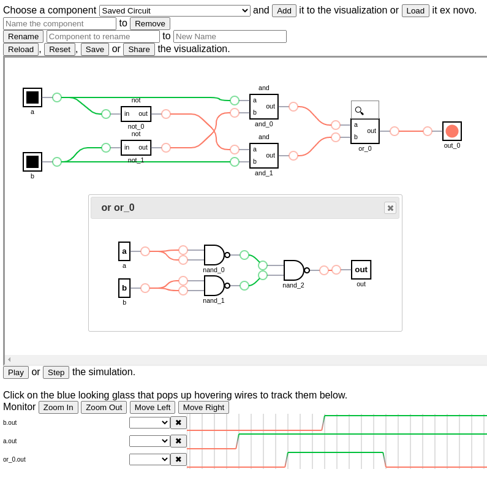

# S.H.E.A.S. - Simple Hardware Editor and Simulator

A prototype of a simple purely graphical hardware editor and simulator for educational purposes, based on [DigitalJS](https://github.com/tilk/digitaljs) visualization library.

### Live Web Page Available [Here](https://sheas.magiwanders.com)

### Documentation
See the [getting started tutorial](docs/getting_started.md)
